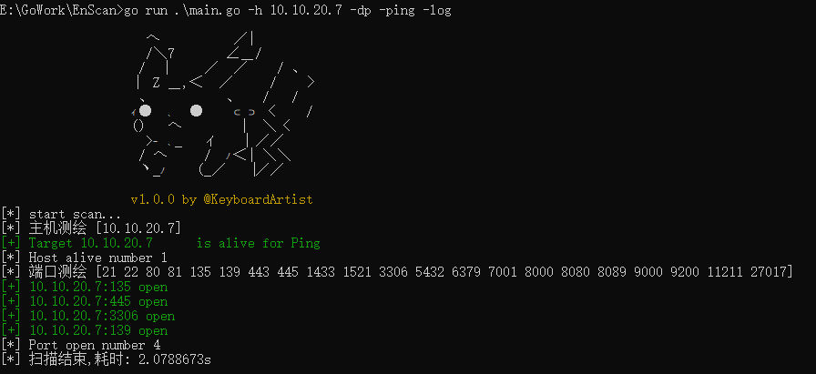

# EnScan

Go语言小白，本项目主要用来学习Go语言编程思想。

本项目依托于两位大佬的工具：

​		https://github.com/XinRoom/go-portScan

​		https://github.com/lcvvvv/kscan

作者主要研究和分析这两种工具来学习相关知识。

会逐渐加入自己的想法！

# 免责声明

**本程序应仅用于授权的安全测试与研究目的，请使用者遵照网络安全法合理使用。**

**使用者使用该工具出现任何非法攻击等违法行为，与作者无关。**

# 使用

提供了两种默认端口组，可以直接给到参数，或者 `-p` 指定其他端口

优先使用Icmp方式探活，可指定 `-ping` 参数

`-log` 默认为false，指定既输出日志到文件

不提供端口信息，默认只进行主机探活

```python
E:\GoWork\EnScan>go run main.go -h

                    へ　　　　　／|
                　　/＼7　　　 ∠＿/
                　 /　│　　 ／　／    / 、
                　│　Z ＿,＜　／　　 /　　〉
                　 、　　　　　、　 /　 /
                　ｲ●　､　●　　⊂⊃〈　　/
                　()　 へ　　　　|　＼〈
                　　>ｰ ､_　 ィ　 │ ／／
                　 / へ　　 /　ﾉ＜| ＼＼
                　 ヽ_ﾉ　　(_／　 │／／

                　v1.0.0 by @KeyboardArtist
flag needs an argument: -h
go-build3971156432\b001\exe\main.exe:
  -dp
        DefaultPorts: 21,22,80,81,135,139,443,445,1433,1521,3306,5432,6379,7001,8000,8080,8089,9000,9200,11211,27017
  -h string
        IP address of the host you want to scan,for example: 192.168.11.11 | 192.168.11.11-255 | 192.168.11.0/24 | 192.168.11.11,192.168.11.12
  -log
        Whether to output logs to a file
  -p string
        Select a port,for example: 22 | 1-65535 | 22,80,3306
  -ping
        Using ping replace icmp
  -t int
        Use Thread nums (default 64)
  -time int
        Set timeout (default 3)
  -wp
        WebPorts: 80,81,82,83,84,85,86,87,88,89,90,91,92,98,99,443,800,801,808,880,888,889,1000,1010,1080,1081,1082,1099,1118,1888,2008,2020,2100,2375,2379,3000,3008,3128,3505,5555,6080,6648,6868,7000,7001,7002,7003,7004,7005,7007,7008,7070,7071,7074,7078,7080,7088,7200,7680,7687,7688,7777,7890,8000,8001,8002,8003,8004,8006,8008,8009,8010,8011,8012,8016,8018,8020,8028,8030,8038,8042,8044,8046,8048,8053,8060,8069,8070,8080,8081,8082,8083,8084,8085,8086,8087,8088,8089,8090,8091,8092,8093,8094,8095,8096,8097,8098,8099,8100,8101,8108,8118,8161,8172,8180,8181,8200,8222,8244,8258,8280,8288,8300,8360,8443,8448,8484,8800,8834,8838,8848,8858,8868,8879,8880,8881,8888,8899,8983,8989,9000,9001,9002,9008,9010,9043,9060,9080,9081,9082,9083,9084,9085,9086,9087,9088,9089,9090,9091,9092,9093,9094,9095,9096,9097,9098,9099,9100,9200,9443,9448,9800,9981,9986,9988,9998,9999,10000,10001,10002,10004,10008,10010,10250,12018,12443,14000,16080,18000,18001,18002,18004,18008,18080,18082,18088,18090,18098,19001,20000,20720,21000,21501,21502,28018,20880
```


